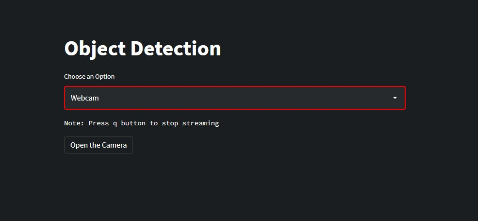

# Object Detection using YOLOV3

### Real Time Object Detection (Image, Webcam, video files) with YOLO Version 3, OpenCV and Streamlit for Deployment  
### Website App: 

### 1- Choose an Option 

###  2- Upload an Image (Video) 

###  3- Show Results 

###  if the option is Webcam press Open Camera Button and it will access your Camera 
